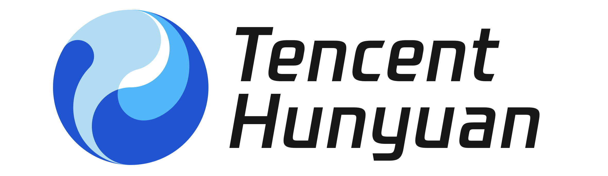
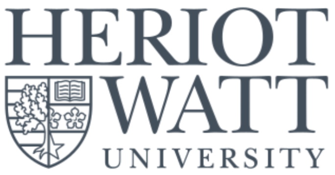
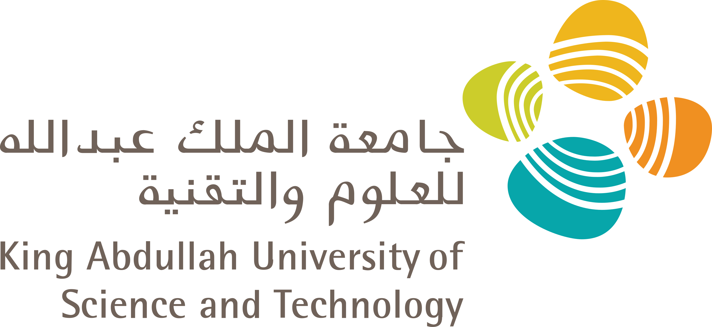
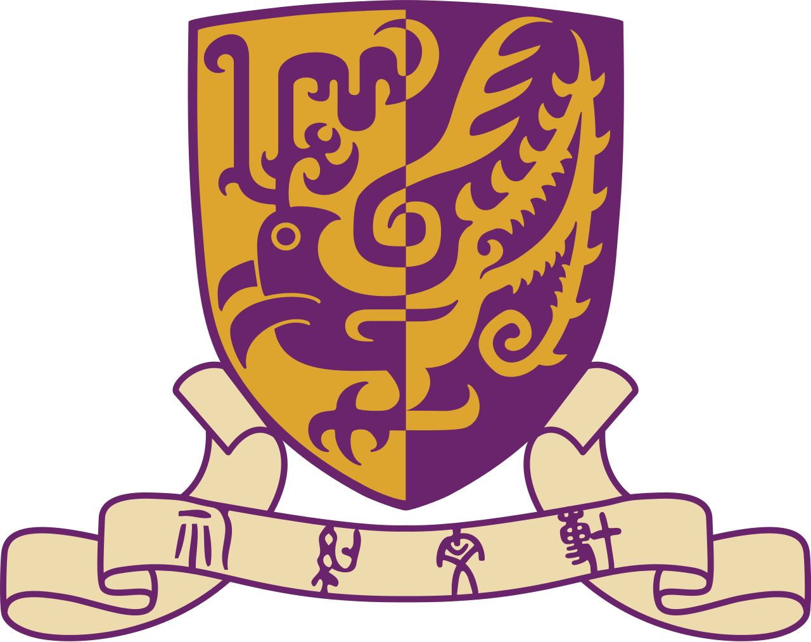
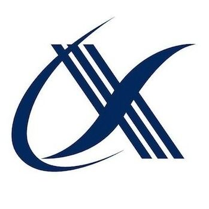

## Experience

<ul style="margin:0 0 5px;">
<li style="display: flex; justify-content: space-between; align-items: center; margin-left: -30px;">
  
    
    Research Scientist, Omni Foundation Model, <a href="https://modelbest.cn/"><strong>ModelBest (面壁智能)</strong></a>
  
  Jul. 2026 – Present
</li>
<li style="display: flex; justify-content: space-between; align-items: center; margin-left: -30px;">
  
    
    Research Intern, Tencent Qingyun Top Talent Program, Hunyuan, <strong>Tencent</strong>
  
  Mar. 2026 – Jul. 2026
</li>
<li style="display: flex; justify-content: space-between; align-items: center; margin-left: -30px;">
  
    
    Research Intern, General Perceptual Computing Group, <strong>SenseTime</strong>
  
  Feb. 2025 – Feb. 2026
</li>
<li style="display: flex; justify-content: space-between; align-items: center; margin-left: -30px;">
  
    
    Remote Research Intern, <a href="https://bioml.eu.org/"> BCML Lab</a>, <strong>Heriot-Watt University</strong>
  
  Mar. 2024 –  Present
</li>
<li style="display: flex; justify-content: space-between; align-items: center; margin-left: -30px;">
  
    
    Remote Research Intern at <a href="https://vision-cair.kaust.edu.sa/">Vision-CAIR</a>, <strong>KAUST</strong>
  
  Dec. 2024 – Jan 2026
</li>
<li style="display: flex; justify-content: space-between; align-items: center; margin-left: -30px;">
  
    
    Research Assistant at LIAS Lab, <strong>CUHK (Shenzhen)</strong>
  
  Apr. 2024 – Nov. 2024
</li>
<li style="display: flex; justify-content: space-between; align-items: center; margin-left: -30px;">
  
    
    Data Analysis Assistant, <strong>iFLYTEK</strong>
  
  Jun. 2023 – Aug. 2023
</li>
</ul>
